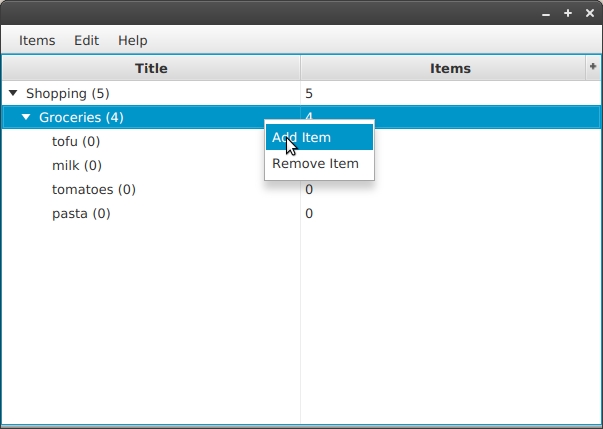

# Structure-List

A prototype of a todo app in JavaFX.
The main source of inspiration is the great [Getting-Things-Gnome](http://gtgnome.net/) application. Sadly, usable versions are only available for linux and I'm forced to work on a windows machine from time to time :-(.

